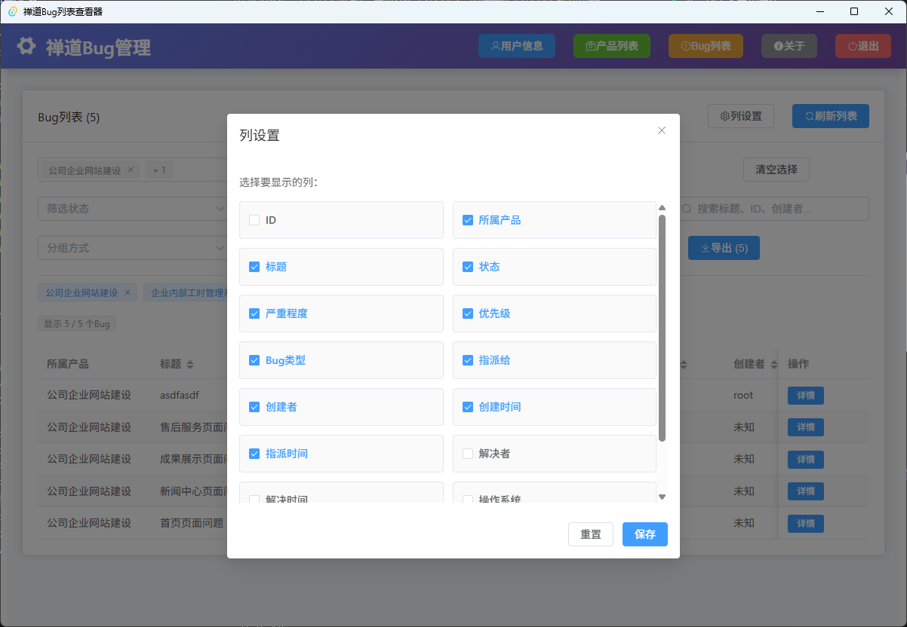

# 禅道Bug管理系统

一个基于 Tauri + Vue 3 + TypeScript 构建的现代化禅道Bug管理桌面应用。

## ✨ 功能特性

- 🔐 安全的用户认证和配置管理
- 👤 用户信息查看和管理
- 📦 产品列表浏览
- 🐛 Bug列表查看和详情
- 🎛️ 自定义列显示功能
- 💾 本地配置持久化存储
- 🎨 现代化的 UI 界面

## 📸 软件截图

### 登录界面


### 用户信息


### 产品列表


### Bug列表


### 列设置功能


## 🚀 快速开始

### 环境要求
- Node.js 18+
- Rust 1.70+
- Tauri CLI

### 安装依赖
```bash
# 安装前端依赖
npm install

# 或使用 pnpm
pnpm install
```

### 开发模式
```bash
# 启动开发服务器
npm run tauri dev

# 或使用 pnpm
pnpm tauri dev
```

### 构建应用
```bash
# 构建生产版本
npm run tauri build

# 或使用 pnpm
pnpm tauri build
```

## 🛠️ 技术栈

- **前端**: Vue 3 + TypeScript + Element Plus
- **后端**: Rust + Tauri
- **构建工具**: Vite
- **UI组件**: Element Plus
- **图标**: Element Plus Icons

## 📋 配置说明

### 首次使用
1. 启动应用后，在登录界面输入：
   - 禅道服务器地址（如：`http://192.168.181.130:81`）
   - 您的账号和密码
2. 点击"保存配置"可将配置保存到本地
3. 下次启动会自动加载保存的配置

### 安全说明
- 所有配置信息都安全存储在本地设备中
- 不会将敏感信息发送到第三方服务器
- 建议使用 HTTPS 地址确保通信安全

## 📁 项目结构

```
tauri-app/
├── src/                    # Vue 前端源码
│   ├── components/         # Vue 组件
│   ├── composables/        # 组合式API
│   ├── services/           # 服务层
│   └── types/              # TypeScript 类型定义
├── src-tauri/              # Rust 后端源码
│   ├── src/                # Rust 源代码
│   └── icons/              # 应用图标
├── screenshots/            # 软件截图
└── public/                 # 静态资源
```

## 🔧 高级功能

### Bug列表自定义列
- 支持自定义显示/隐藏列
- 设置自动保存到本地
- 详细说明请参考 [COLUMN_FEATURES.md](./COLUMN_FEATURES.md)

### 配置安全
- 移除了硬编码的敏感信息
- 详细安全指南请参考 [CONFIG_SECURITY.md](./CONFIG_SECURITY.md)

## 🤝 贡献指南

欢迎提交 Issue 和 Pull Request！

## 📄 许可证

MIT License

## Recommended IDE Setup

- [VS Code](https://code.visualstudio.com/) + [Vue - Official](https://marketplace.visualstudio.com/items?itemName=Vue.volar) + [Tauri](https://marketplace.visualstudio.com/items?itemName=tauri-apps.tauri-vscode) + [rust-analyzer](https://marketplace.visualstudio.com/items?itemName=rust-lang.rust-analyzer)
